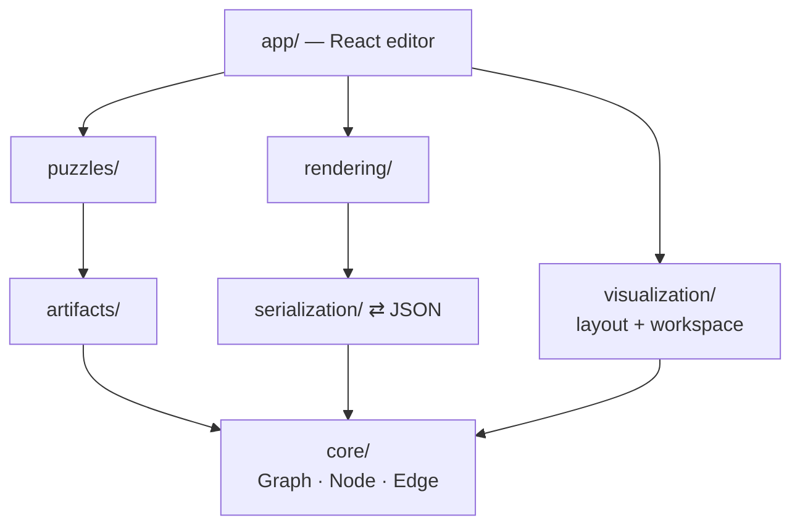
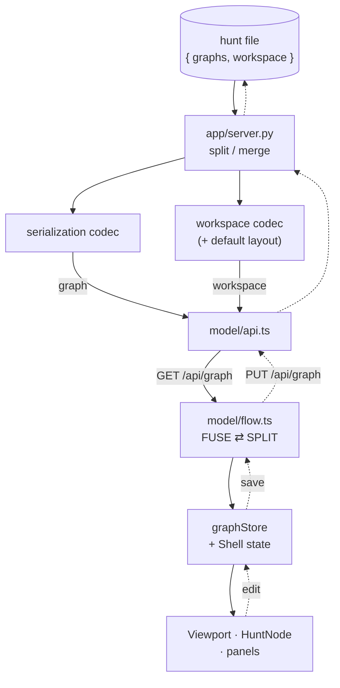

# Architecture

This is the map a new developer should read first: **how the pieces fit together and
how data moves through them.** It is the canonical reference for the system's shape.

It deliberately stays at the level of *layers, responsibilities, and the seams between
them* — the things that change rarely. It does **not** repeat function signatures, file
layouts, or API shapes; each layer has its own detailed doc, and this file links down to
them. If a detail here ever contradicts a per-layer doc, the per-layer doc wins.

| Layer | Detailed doc |
| --- | --- |
| Artifacts | [`src/puzzcombinator/artifacts/ARTIFACTS.md`](src/puzzcombinator/artifacts/ARTIFACTS.md) |
| Puzzles | [`src/puzzcombinator/puzzles/PUZZLES.md`](src/puzzcombinator/puzzles/PUZZLES.md) |
| Core graph | [`src/puzzcombinator/core/GRAPHS.md`](src/puzzcombinator/core/GRAPHS.md) |
| Rendering / binder | [`src/puzzcombinator/rendering/RENDERING.md`](src/puzzcombinator/rendering/RENDERING.md) |
| Visualization | [`src/puzzcombinator/visualization/VISUALIZATION.md`](src/puzzcombinator/visualization/VISUALIZATION.md) |
| Editor (GUI) | [`src/puzzcombinator/app/APP.md`](src/puzzcombinator/app/APP.md) |

## What this system is

A **design-time library for authoring treasure-hunt games.** A designer uses it to create
puzzles, compose them into a hunt, and generate printable materials. It does **not** play
or grade a hunt: in a physical hunt, correctness is implicit (one puzzle's output is the
next one's input — the key fits the lock). There is no answer-checking anywhere. Live
progress-tracking is a separate, future layer.

## The model: what a hunt *is*

Everything else is built to produce, store, or display this one structure, so understand
it first.

A hunt is a **directed graph of actions, and the graph is the flow of artifacts:**

- A **Node** is a *pure action* — a free-form verb (`"solve"`, `"find"`, `"move"`). It
  holds no player state and no payload. Start and end nodes are *derived from topology*
  (no incoming / no outgoing edges), not flagged.
- An **Edge** carries `content`: the **artifacts** flowing from one action into the next.
- An **Artifact** is the universal *thing that renders* riding on edges — a
  registry-backed, serializable renderable (a clue text, an image, a cipher, …). It is
  the single currency the graph, storage, and display layers all speak.
- A **Puzzle** is an *authoring-time generator*, not part of the stored graph. It emits a
  `{name: Artifact}` map of all its pieces (prompt *and* answer key alike); the designer
  places those artifacts onto edges. So a multi-piece puzzle is just a generator whose
  artifacts can be placed together or scattered across the graph and reassembled.

The model is **stateless** and **authoring-only** — there is no notion of a player, a
position, or a "solved" flag anywhere in it.

## The layered stack

Layers depend strictly **downward**. Nothing reaches sideways or up. Three layers
(`core`, `serialization`, `rendering`) are **artifact-agnostic**: they never name a
concrete artifact type, working only through the `Artifact` abstraction + the registry.
That is what lets you add a new artifact type by touching only its own layer.

A second separation runs alongside that one: **actual hunt data vs. its visual
representation.** The data layers (`core`/`artifacts`/`puzzles`/`serialization`/
`rendering`) know nothing about *drawing*; `visualization/` is the deliberate, file-tree-
visible home for that — node positions (`layout`) and the editor's workspace of views and
tabs (`workspace`). `app/` composes the two channels into one saved file.

(Deps point **downward only**. `app/` sits on top, composing the data and UI channels;
everything bottoms out at `core/`. `core`, `serialization`, and `rendering` are
*artifact-agnostic*; `core` is *stdlib-only*.)

`visualization/` reads `core` (its layout query needs a graph) but is UI state, not hunt
data — and `core`/`serialization` never learn it exists.

`core` is pure standard-library Python (dataclasses; no pydantic, no heavy deps). Format
knowledge lives *only* in `serialization`. Any heavy dependency, if ever needed, lives
*only* inside the one artifact that needs it.

## The data lifecycle: generated → stored → displayed

This is the path a newcomer most wants to trace.

### Generated — `puzzles/` + `artifacts/`

The designer constructs the content. **Puzzle generators** (`puzzles/`: cipher, crossword,
r4, riddle) emit their artifacts; **orphan artifacts** with nothing to generate (text,
image — `artifacts/`) are constructed directly. Either way the output is `Artifact`
instances. The designer wires them onto edges with a `GraphBuilder`, which hands back
node *handles* (ids) and connects them — producing a `Graph` (and, for a whole saved
hunt, a `HuntDocument` wrapping one or more graphs).

### Stored — `serialization/` (the seam)

`serialization/` is the **one place that knows the on-disk shape**, and it is the
*interchange seam* every higher layer talks through. It round-trips the model to JSON/YAML
compositionally — each level serializes its own slice, no type-switching — with the
keystone invariant `from_dict(to_dict(x)) == x`. Each edge's artifacts round-trip through
the **registry** as `{type, id, name, payload}`, which is how an artifact-agnostic layer
can rebuild concrete types it never names.

Two things make this seam durable:

- **The envelope is additive.** New top-level data (more graphs, floating artifacts,
  geo-coordinates) needs no migration; the schema version bumps only for *non-additive*
  changes.
- **Two separate channels, never mixed.** *Hunt data* (the graph itself — nodes, edges,
  artifacts) is the source of truth, owned by `serialization` + `HuntDocument`. *Workspace
  state* (purely where/how a hunt is *drawn* — node x/y, which views and tabs are open) is
  a separate channel owned by `visualization/workspace.py`, with its own self-contained
  codec that references nodes by opaque id and never imports the hunt-data model.
  `serialization` stays UI-ignorant; the `app` layer composes the two into one saved file
  (they *could* be two files — the codecs are independent). A hunt is fully valid with no
  workspace state; the editor falls back to the auto-`layout`.

### Displayed — `rendering/` and `app/`

Two independent consumers of the model, for two audiences:

- **`rendering/` — print/export.** Artifacts render to HTML/SVG fragments; a **binder**
  (composable `Section` → `Chapter` → `Binder`) assembles any chosen collection of
  renderings into one standalone document. A binder is *not* a fixed thing — it's whatever
  the designer assembles (an answer key, a page-per-node walkthrough, …). Artifact-agnostic
  and pure (renders to a string).
- **`app/` — the editor (GUI).** A web editor for authoring a hunt visually instead of in
  code. Its Python backend (FastAPI) exposes the serialization seam over HTTP; its frontend
  (React + React Flow) draws the graph and edits it. It is the one layer that both
  *consumes* the seam (to draw) and *produces* it (to save) — and it modifies no lower
  layer.

### The editor round-trip — the path one request takes

Tracing a single editor load-then-save makes the two-channel seam concrete: the file holds
both channels, the `app` layer **splits** them apart to send and merges them back to store,
and the frontend **fuses** them into React Flow nodes on load / **splits** them again on
save. The fuse/split points (`toFlowGraph` ⇄ `buildSaveRequest`) are where the two channels
meet — everywhere else they travel separately. For the frontend-internal detail (module map,
the four node-ish types, the sequence of calls) see
[`frontend/FRONTEND.md`](frontend/FRONTEND.md).

(Solid edges = **load** (file → screen); dashed edges = **save** (screen → file). `flow`
fuses the two channels into React Flow nodes on load and splits them apart on save. The
graph channel is validated on save; the workspace channel is GUI state and is not.)

## The rule that ties it together

**GUI = producer, binder = consumer, model + serialization = the seam.** Higher layers meet
only through the serialized model; none reaches into another's internals. This is why the
frontend could be swapped wholesale (vanilla SVG → React Flow) without touching a line of
Python: the seam absorbed the change.

## Invariants worth not breaking

- **Authoring-only.** No validator / answer-checking / "solved" state anywhere. (Grading,
  if it ever exists, is a future *separate* layer — the only place it would live.)
- **Artifact-agnostic core, serialization, and binder.** They go through the `Artifact`
  abstraction and the registry; they never name a concrete artifact type.
- **String ids, no object cycles.** Edges reference nodes by id; ids are auto-generated,
  not author-invented. Artifact equality is value-based (type + id + name + payload), which
  is what makes the round-trip equality invariant hold.
- **Loose I/O coupling.** A puzzle's answer is *not* auto-linked to an outgoing edge; the
  designer places the answer artifact by hand.

For how to add a new artifact or puzzle type, see `ARTIFACTS.md` and `PUZZLES.md`
— by design it touches only that layer.
