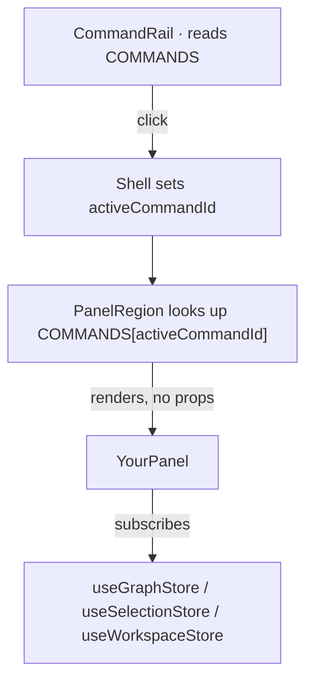

# Adding a command to the rail — a contributor walkthrough

This is the step-by-step guide for adding a new **command** to the editor (a button in the
left rail that opens a panel — Puzzle, Bind, Arrange, …). It assumes you've skimmed
[`FRONTEND.md`](FRONTEND.md) (what the code is) and [`design/DESIGN.md`](design/DESIGN.md)
(why the shell is shaped this way). It uses the already-built **GRAPH** command (the node
inspector) as the worked example throughout — every step points at the real file that did
it, so you can read the finished version alongside the instructions.

The whole reason this is short: the editor is a **shell** (stable regions) with **features**
(panels) that plug into a **command registry**. Adding a command means *filling a slot that
already exists* — you write one panel component and add one registry entry. You do **not**
touch the rail, the panel region, the tab bar, or the canvas.

---

## TL;DR checklist

1. [ ] **Run the app** and confirm it works before you change anything.
2. [ ] **Decide the data** your command needs — and whether the backend already sends it.
3. [ ] *(only if new data)* **Add the backend endpoint/field** first.
4. [ ] **Write the panel** in `src/panels/YourPanel.tsx` — a `FC` that takes **no props** and
       subscribes to the stores it needs (graph / workspace / selection).
5. [ ] *(only if it needs state no store holds yet)* **add it to the right store** —
       `graphStore` (undoable graph mutations), `workspaceStore` (views/tabs/UI), or
       `selectionStore` (transient selection) — then subscribe to it.
6. [ ] **Register it** in `src/shell/commands.ts` (new `CommandId` + `COMMANDS` entry, or
       swap a placeholder's `Panel`).
7. [ ] **Style it** in `src/shell/shell.css` using `theme.css` tokens (no inline styles).
8. [ ] **Verify**: `npm run build` (type gate) + `npm run lint`, then click through it.

---

## Step 0 — Run the app first

Two processes (from the repo root and `frontend/` respectively):

```bash
# backend — point it at a real hunt file so Save works (demo mode disables saving).
# tmp/test_hunt.json is a throwaway you can regenerate; see "Generating a test hunt" below.
PUZZ_GRAPH=tmp/test_hunt.json python -m uvicorn puzzcombinator.app.server:app --reload

# frontend
cd frontend && npm install          # first time only
npm run dev                         # http://127.0.0.1:5173 (proxies /api to :8000)
```

Open the URL, click **Graph** in the rail, click a node — the panel fills with its fields.
That's the feature you're about to clone the shape of.

> **Generating a test hunt** (a JSON file the backend can load *and save back to*):
> ```bash
> python -c "from puzzcombinator.app.demo import build_demo_graph; \
> from puzzcombinator.core.document import HuntDocument; \
> from puzzcombinator.serialization import to_json; \
> open('tmp/test_hunt.json','w').write(to_json(HuntDocument.single(build_demo_graph())))"
> ```
> Keep it in the repo's gitignored `tmp/` dir — never write scratch outside the repo.

---

## Step 1 — Decide what your command needs

Before writing code, answer two questions:

1. **What data does the panel show or edit?** Panels take **no props** — each subscribes to
   the stores it needs (this replaced an older catch-all `PanelProps` object). There are
   three stores, one per concern:

   - **`useGraphStore`** (`src/shell/graphStore.ts`) — the undoable graph: `nodes`, `edges`,
     and the mutating actions (`updateNode`, `createNode`, `createLooseArtifact`,
     `placeArtifactOnEdge`, `detachArtifact`, …).
   - **`useSelectionStore`** (`src/shell/selectionStore.ts`) — `selection`: what's selected on
     the canvas (a node, an edge, or null).
   - **`useWorkspaceStore`** (`src/shell/workspaceStore.ts`) — `workspace` (views/tabs/active
     tab) and its actions (`selectView`, `setShowUnplaced`, …).

   GRAPH reads `selection` from the selection store, looks the node up in `nodes` from the
   graph store, and edits via `updateNode` — all by subscribing, no props. (Saving is **not**
   a panel concern: it's a global action in the menu bar that commits the whole graph — see
   `MenuBar.tsx` / `Shell.tsx`.) If everything your command needs already lives in a store, you
   write **only** the panel (Steps 4, 6, 8) and skip Steps 3 and 5.

2. **Does it need data the backend doesn't send yet?** If your panel needs something new from
   the server (a rendered artifact preview, a re-layout, a list of files…), that's a backend
   change *first* — see Step 3. GRAPH needed none: a node's `label`/`action`/`notes` are
   already in `NodeDTO`, and `PUT /api/graph` already existed for Save.

---

## Step 2 — (Reference) how the pieces connect

So you know what you're plugging into:



- `src/shell/commands.ts` — the registry (`COMMANDS`). **The only shell file you must edit** to
  add a command (besides writing your panel).
- `src/panels/*.tsx` — the panels. You **add a file here**, and it subscribes to stores itself.
- The stores (`src/shell/graphStore.ts`, `workspaceStore.ts`, `selectionStore.ts`) — edit one
  **only if** your command needs state none of them holds yet (Step 5).
- `src/shell/shell.css` — panel styling.

You do not edit `Shell.tsx`, `CommandRail.tsx`, `PanelRegion.tsx`, `TabBar.tsx`, or
`Viewport.tsx` — the shell wires regions, but a panel reaches its data through stores, not
through the shell.

---

## Step 3 — (Only if you need new backend data) extend the seam first

Skip this if your command works off the existing stores alone (most editing commands do).

If you need new server data, the order is: backend → DTO → adapter → panel.

1. Add/extend the endpoint in the FastAPI app (see
   [`../src/puzzcombinator/app/APP.md`](../src/puzzcombinator/app/APP.md)).
2. Mirror the wire shape as a `*DTO` interface in `src/model/api.ts` and add the `fetch`/`PUT`
   helper next to `fetchGraph`/`saveGraph`.
3. If it changes the graph→canvas mapping, do it in the **pure** `src/model/flow.ts` (the
   `toFlowGraph`/`toGraphBlock`/`toPool` fuse-and-split functions) and add a unit test next to
   it, `model/flow.test.ts` — it's the easy place.

Naming rule: wire types end in `DTO` (`NodeDTO`); view-model types start with `Hunt`
(`HuntFlowNode`). Don't blur them.

---

## Step 4 — Write the panel component

Create `src/panels/YourPanel.tsx`. A panel takes **no props**: it subscribes to the stores it
needs and holds no graph state of its own. Each `use*Store((s) => s.field)` call selects one
slice and re-renders the panel when just that slice changes.

The GRAPH panel (`src/panels/GraphInspector.tsx`) is the reference. Its shape:

```tsx
import { useGraphStore } from '../shell/graphStore'
import { useSelectionStore } from '../shell/selectionStore'

export function GraphInspector() {
  const nodes = useGraphStore((s) => s.nodes)
  const updateNode = useGraphStore((s) => s.updateNode)
  const selection = useSelectionStore((s) => s.selection)

  if (!selection) return <p className="inspector__empty">Select a node…</p>

  const node = nodes.find((n) => n.id === selection.id)
  if (!node) return <p className="inspector__empty">Node not found.</p>

  return (
    <div className="inspector">
      {/* SELECTED: controlled inputs that call updateNode on every keystroke */}
      <input
        className="field__input"
        value={node.data.label}
        onChange={(e) => updateNode(node.id, { label: e.target.value })}
      />
      {/* RELATED: derived from edges — incoming = e.target === id, outgoing = e.source === id */}
    </div>
  )
}
```

Things to copy from it:

- **Subscribe to stores, don't take props.** One `use*Store((s) => s.x)` selector per slice;
  the panel re-renders only when a selected slice changes. This is how every panel reaches its
  data (ViewPanel reads the workspace store the same way).
- **Controlled inputs.** The `<input value=… onChange=…>` pattern: the value comes *from* the
  store, and editing calls a store action that updates it — React re-renders with the new
  value. Don't keep a second copy of the field in local state.
- **Handle the empty/missing cases** (`!selection`, node not found) with a friendly message,
  like the `inspector__empty` lines.
- **Derive, don't store.** GRAPH computes a node's related edges on the fly from `edges`
  (`edges.filter((e) => e.target === node.id)`) — no extra state. The client mirror of the
  Python `required_inputs`/`produced_outputs`.
- **No style values in the component** — class names only (see Step 7).

If your command isn't ready to build yet but you want it on the rail, the
`PlaceholderPanel.tsx` pattern (a panel that renders "Not built yet.") is the stand-in — that
is exactly what the other six commands use today.

---

## Step 5 — (Only if needed) lift new state into the shell

Skip this if the existing stores already hold what you need.

If your panel needs shared state or a callback no store exposes yet, add it to the store whose
concern it matches, then subscribe to it from your panel:

- **It mutates the graph** (nodes/edges/artifacts) → add the action to the **graph store**
  (`src/shell/graphStore.ts`). The graph lives in a zundo-backed Zustand store so edits are
  undoable; `updateNode` is the example to copy. Any new graph mutation should be a store
  action (so it flows through undo/redo too).
- **It's workspace state** (views/tabs, the per-view `show_unplaced` flag) → add it to
  `workspaceStore.ts`, which is **not** undoable (UI navigation shouldn't pollute the graph's
  undo history); `setShowUnplaced` is the example to copy.
- **It's transient canvas selection** → it already lives in `selectionStore.ts`.

Don't reach for a side channel or thread props through the shell — a panel gets everything by
subscribing. Keep each store scoped to its concern (the graph store is for the undoable graph
only; don't pour unrelated UI state into it).

```ts
// in graphStore.ts — a graph mutation, undoable
updateNode: (id, patch) =>
  set({ nodes: get().nodes.map((n) => (n.id === id ? { ...n, data: { ...n.data, ...patch } } : n)) }),

// in your panel — subscribe to it (re-renders only when that slice changes)
const updateNode = useGraphStore((s) => s.updateNode)
```

---

## Step 6 — Register the command

This is the plug-in step, and the only edit to the shell itself. In
`src/shell/commands.ts`:

**If you're activating one of the existing placeholder commands** (View, Puzzle, Bind,
Arrange, Manage, Save/Load) — just import your panel and swap its `Panel`:

```diff
+import { ArrangePanel } from '../panels/ArrangePanel'
 ...
-  { id: 'arrange', label: 'Arrange', icon: '⊞', Panel: PlaceholderPanel },
+  { id: 'arrange', label: 'Arrange', icon: '⊞', Panel: ArrangePanel },
```

**If it's a brand-new command** not in the list, add its id to the `CommandId` union and push
a new `COMMANDS` entry:

```diff
 export type CommandId =
   | 'view'
   | 'graph'
+  | 'stats'
 ...
 export const COMMANDS: CommandDescriptor[] = [
   ...
+  { id: 'stats', label: 'Stats', icon: '∑', Panel: StatsPanel },
 ]
```

That's it — the rail renders the new button and the panel region renders your panel when it's
active. The `icon` is a single glyph for now (no icon library yet); the `label` shows next to
it and as the panel header / tooltip.

---

## Step 7 — Style it

Add your panel's CSS to `src/shell/shell.css`. Two hard rules (see `FRONTEND.md`):

- **No inline styles and no hardcoded color/size values in components** — components carry
  class names only.
- **Pull every color/size from a `theme.css` `:root` variable** (e.g. `var(--shell-border)`,
  `var(--shell-accent)`). If you need a value that isn't a token yet, add the token to
  `theme.css` first, then use it. That's what keeps the theme swappable.

The inspector's block (`.inspector`, `.field`, `.field__input`, `.related`, …) at the bottom
of `shell.css` is the example to mirror.

---

## Step 8 — Verify

```bash
cd frontend
npm run build      # tsc -b && vite build — the type-check gate; must pass
npm run lint       # eslint; must pass
```

Then click through it in the browser (Step 0): open your command from the rail and exercise
it. (Saving is global — the menu bar's Save commits the whole graph; with `PUZZ_GRAPH` set it
persists, in demo mode it returns **409**.)

If you added or changed **pure logic** (a `model/` function, or a helper like those in
`shell/history.ts`), add a co-located `*.test.ts` and run `npm test` (Vitest). That's where
we put real coverage — pure, movable pieces — while component/E2E tests wait for the
interface to settle. `npm run build` is still the type-check gate.

---

## What you touched, at a glance

For a typical editing command (works off the existing stores): **two files** —
`src/panels/YourPanel.tsx` (new, subscribes to stores) and `src/shell/commands.ts` (one line),
plus some CSS in `shell.css`. Only if it needs new shared state do you also touch a store
(`graphStore.ts` for graph mutations, `workspaceStore.ts` for UI state); only if it needs new
server data do you also touch `model/api.ts` (+ maybe `model/flow.ts`) and the backend. You
never restructure the shell — that's the whole point of building it first.
