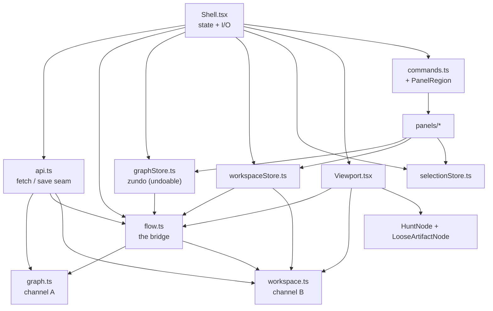
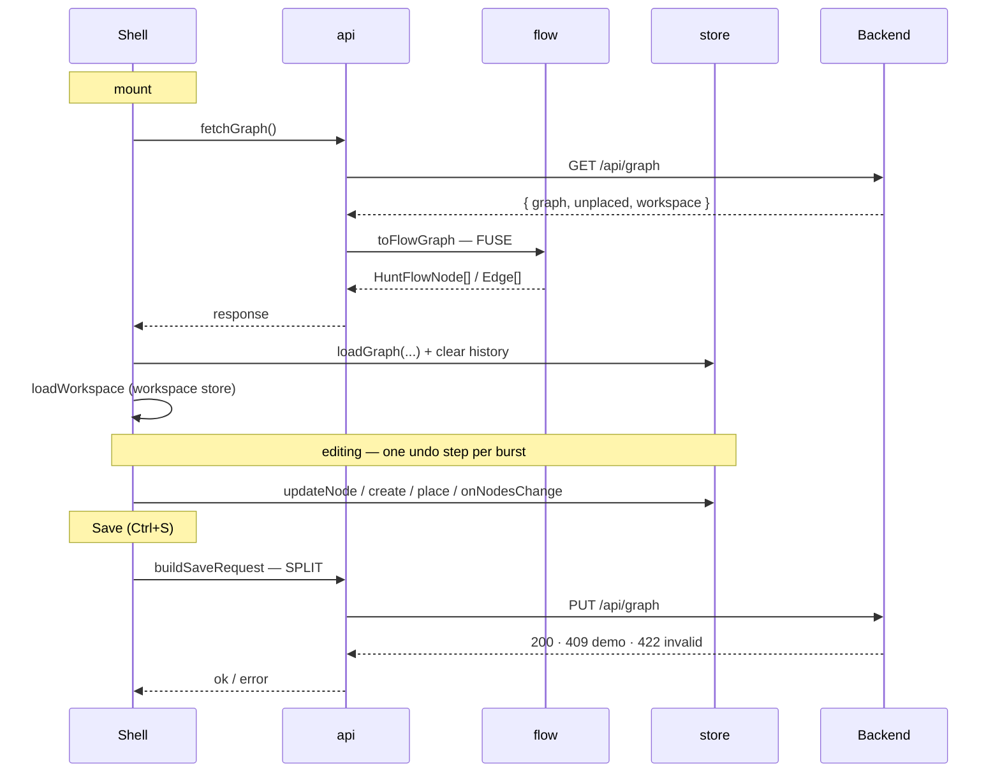

# Editor frontend

The UI for the hunt editor: a **React + React Flow** app (built with **Vite**, in
**TypeScript**) that draws the hunt graph and lets you edit it — create and delete nodes,
create loose artifacts, move artifacts between the unplaced pool and edges, switch views, all
undoable. It is a pure consumer/producer of the backend's JSON seam; it owns no hunt data of
its own.

The Python backend that serves that seam (the FastAPI app, the graph layout, the
workspace channel) is documented in
[`../src/puzzcombinator/app/APP.md`](../src/puzzcombinator/app/APP.md) — read that for the
server and the `/api/graph` shape. **This doc is the frontend code: what's here, how it's
organized, and how to add a feature.**

For how the UI should *look and behave* — the interface design worked out before the code —
see [`design/DESIGN.md`](design/DESIGN.md) and the per-feature specs alongside it. (This doc
describes the code that exists; `design/` describes what we intend to build and why.)

## What's actually in here (and what isn't)

A frontend directory looks alarming the first time, but **git tracks ~30 small text
files.** The hundreds of megabytes you see on disk are not in the repo:

```
frontend/
├── node_modules/   ~160 MB, ~120 packages   ← NOT in git. downloaded library code.
│                                               recreate anytime with `npm install`.
├── dist/           build output              ← NOT in git. made by `npm run build`.
└── ~30 tracked files                         ← the actual repo. tiny.
```

`node_modules/` is where npm downloads the libraries you depend on. You ask for a few
(React, React Flow, Vite); each of *those* depends on others, which depend on others — so a
handful of requests fan out to ~120 packages. **This is normal for every JS project**, and
it's exactly why it's gitignored: you never commit it, you regenerate it with `npm install`.
`package.json` + `package-lock.json` are the recipe that makes that reproducible.

## The files

Stack: React + React Flow (v12, `@xyflow/react`) + Vite + TypeScript, plus
**`react-resizable-panels`** (v4 — `Group`/`Panel`/`Separator`) for the draggable panel
divider, and **Zustand + zundo** for the graph store and its Undo/Redo history. No router —
it's one screen built as a *shell* (stable regions) with *features* (panels) plugging into
it.

`src/` is grouped by role: entry + global CSS at the root, then `model/` (the backend seam),
`nodes/` (canvas node components), `shell/` (the chrome), `panels/` (features). Tests live
next to their source (`*.test.ts`).

**Entry + globals (`src/`):**

| File | What it is |
| --- | --- |
| `main.tsx` | Entry point — mounts `<App>` into the page. Set once. |
| `App.tsx` | Now trivial: it just renders `<Shell />`. (State + I/O moved into the shell.) |
| `theme.css` | Every color/size as a `:root` CSS variable — the **swappable theme** (node colors *and* the shell-chrome tokens). |
| `index.css` | Structural reset (full-viewport). |

**The seam + pure adapters (`src/model/`):**

| File | What it is |
| --- | --- |
| `graph.ts` | The **hunt-data channel** (echoes Python `serialization/`): the wire DTOs `NodeDTO`/`EdgeDTO`/`ArtifactDTO`/`GraphBlockDTO`. Pure data; no drawing. |
| `workspace.ts` | The **workspace channel** (echoes Python `visualization/`): the UI-state DTOs `WorkspaceDTO`/`ViewDTO`/`TabDTO`/`PositionDTO`/`ViewportDTO` (`ViewDTO` carries the per-view `show_unplaced` flag) + the pure mutations (`setShowUnplaced`, `renameView`, …). References nodes by opaque id only. |
| `flow.ts` | The **bridge** (echoes `visualization/defaults.py`): the React Flow view-model (`HuntFlowNode`, `LooseArtifactFlowNode`, their union `CanvasNode`, `HuntFlowEdge`, `NodeFields`) and the `CanvasGraph` `{nodes, edges}` pair type, plus the pure transforms — `toFlowNodes`/`toFlowArtifacts`/`toFlowEdges` (load), `toGraphBlock`/`toPool`/`toPositions` (save), and the editing transforms `withArtifactPlaced`/`withArtifactDetached`/`detachedArtifactNodes`/`withLooseArtifactsHidden`. The only module that knows both channels. |
| `api.ts` | The **composition seam** (echoes Python `app/`): `GraphResponseDTO`/`SaveRequestDTO` (the graph, the `unplaced` pool, and the workspace as siblings) + `fetchGraph()` / `saveGraph()`, and `toFlowGraph`/`buildSaveRequest` (fuse on load, split on save). |
| `flow.test.ts` | Vitest units for the projection (null↔'' coalescing, round-trip, position extraction). |

**Canvas node components (`src/nodes/`):**

| File | What it is |
| --- | --- |
| `HuntNode.tsx` | The **hunt-node component**: renders one graph node's box from its `data` (label or a shortened id when unlabelled). No style values (class names); carries the four side `Handle`s a connection can start from. A new node *type* is another component here, registered in `shell/Viewport.tsx`'s `nodeTypes`. |
| `LooseArtifactNode.tsx` | The **loose-artifact component**: draws an unplaced (pooled) artifact as a non-connectable card showing only its `type` + `name` (never the type-specific payload). No `Handle`s — a loose artifact isn't wired; it meets an edge by being placed on it. |
| `shortId.ts` | `shortId(id)` — a node's 6-char id stub (git-hash style) shown when it has no label. |

**The shell — the stable region skeleton (`src/shell/`):**

| File | What it is |
| --- | --- |
| `Shell.tsx` | The **orchestrator**. Wires the regions with `react-resizable-panels`, projects the displayed nodes (honoring the active view's `show_unplaced`), and routes the canvas's selection into the selection store. Self-contained behaviors live in hooks beside it — `usePersistence`, `useUndoRedo`, `useKeyboardShortcuts` — so this file stays "gather state, lay out regions" with only the small remaining UI state (active command) as plain hooks. |
| `usePersistence.ts` | The **load/save lifecycle hook**, lifted out of `Shell`: seeds both stores from the backend on mount, exposes `onSave` + `saveState` + a memoized `isDirty` (a snapshot compare of the save payload). Subscribes to the stores it needs directly, like a panel. |
| `useUndoRedo.ts` | The **undo/redo hook**: the temporal store's reactive `canUndo`/`canRedo` flags + the `onUndo`/`onRedo` actions (which end any hover-preview first, since undo/redo operate on the live nodes). |
| `useKeyboardShortcuts.ts` | The **global keyboard hook**: binds the chords (`Ctrl/⌘+S` save, `Ctrl/⌘+Z` undo, `Ctrl/⌘+Shift+Z`/`Ctrl/⌘+Y` redo) to handlers passed in. The home for keyboard handling — registry-driven command mnemonics (focus-guarded) would land here too. |
| `graphStore.ts` | The **graph store** — a Zustand + zundo `temporal` store holding the *undoable* canvas: `nodes` (hunt **and** loose-artifact nodes, positions *and* fields) + `edges`, and its mutators (`createNode`, `createLooseArtifact`, `updateNode`, `placeArtifactOnEdge`, `detachArtifact`, `detachEdges`, `setNodePositions`, the React Flow change handlers). One user action = one undo step (`equality` ignores selection/drag flags & rounds positions; a leading-edge `handleSet` debounce coalesces bursts). Positions ride here for now (see the data-flow section). |
| `workspaceStore.ts` | The **workspace store** — a Zustand store (deliberately **not** undoable) holding the `WorkspaceDTO` (views/tabs/active tab) + the view/tab actions (`selectView`/`selectTab`/`createView`/`createTab`/`deleteView`/`deleteTab`/`renameView`/`setShowUnplaced`/viewport + hover-preview). Owns the position-lifecycle dance on view switches (flush live drags, reproject, reset history). |
| `selectionStore.ts` | The **selection store** — a tiny Zustand store for the transient canvas `selection` (a node, an edge, or null). Not undoable, not saved; the canvas writes it, panels read it. |
| `MenuBar.tsx` | The full-width top **menu bar**: global Undo / Redo + a single Save with a dirty indicator. Pure presentational; fed by `Shell.tsx`. |
| `CommandRail.tsx` | The left **command rail**: one button per registry entry; collapses to a sliver. A dumb container — reads `COMMANDS`, reports clicks up. |
| `TabBar.tsx` | The top **tab bar**: one chip per open *tab* (each showing a *view*), plus a persistent `+` (new tab) and a per-tab `×` (close). Hovering a tab previews it; clicking selects. Driven by the workspace store. |
| `PanelRegion.tsx` | The **swappable panel**: looks the active command up in the registry and renders its `Panel` with **no props** (panels subscribe to the stores they need). Knows no specific panel. |
| `Viewport.tsx` | The **viewport region**: wraps `<ReactFlow>` to draw the active tab's view, reports selection up, and re-`fitView`s on container resize (the one React Flow resize gotcha). |
| `commands.ts` | The **command registry**: the `COMMANDS` list pairing each command id with the panel it opens (panels are typed `FC`, no props). The single plug-in point — add a command here, nowhere else. |
| `types.ts` | The small shared value types: `Selection` (what's selected on the canvas) and `SaveState`. Panels don't take props — they subscribe to stores — so there's no `PanelProps`. |
| `history.ts` | Pure undo-granularity helpers used by `graphStore.ts`: `graphSignature` (what counts as a meaningful change) and `leadingDebounce` (how a burst collapses to one step). Kept separate so they're unit-testable. |
| `history.test.ts` | Vitest units for `graphSignature` + `leadingDebounce`. |
| `shell.css` | Region + panel styling. Structural/visual CSS using `theme.css` tokens (no hardcoded values). |

**The features — panels that plug into a region (`src/panels/`):**

| File | What it is |
| --- | --- |
| `GraphPanel.tsx` | The **GRAPH** command's panel: with a node selected, edit its label/action/notes and see its incoming/outgoing edges + artifacts; with an edge selected, list its artifacts (each with **Detach**) and the pool (each with **Place**). Subscribes to the graph + selection stores; takes no props. |
| `ViewPanel.tsx` | The **VIEW** command's panel: list/switch/create/rename/delete views, auto-arrange, and the per-view **Show unplaced artifacts** toggle. Subscribes to the workspace (and graph) store. |
| `scratch/` | The **SCRATCH** rail command — a playground whose self-contained `<Section>`s (document new/open, node create, artifact create, artifact preview) subscribe to stores directly (or, for document switching, hit the backend and reload), so each lifts into its real command once it settles. The preview section lists every artifact (pool + edges) and renders the selected one via `POST /api/render` into a sandboxed `<iframe>`. |
| `PlaceholderPanel.tsx` | The stand-in every not-yet-built command opens, so the rail shows the full intended command set. |

**Config — set once, rarely opened:** `index.html` (the page React loads into),
`package.json` (deps + the `dev`/`build` scripts), `package-lock.json` (npm's exact-version
lock — auto-managed, never hand-edited), `vite.config.ts` (Vite settings; holds the `/api`
proxy), `tsconfig*.json` ×3 (TypeScript compiler settings, split by Vite convention),
`eslint.config.js` (lint rules), `.gitignore` (ignores `node_modules`/`dist`),
`public/favicon.svg` (the browser-tab icon).

## The architecture: a shell, not a screen

The editor is a **shell** (a stable skeleton of *regions* — command rail, tab bar,
swappable panel, canvas) plus **features** (self-contained components that live inside a
region). The payoff is that adding a feature never restructures the app — you fill a slot
that already exists. The design rationale lives in [`design/DESIGN.md`](design/DESIGN.md);
the seams that hold it together are:

- **The command registry (`shell/commands.ts`).** Each command is a `{ id, label, icon,
  Panel }` descriptor. The rail renders a button per entry; the panel region renders the
  active entry's `Panel`. Neither names a specific command — so a new one is *one entry*.
- **Stores, not props.** A panel takes **no props** — it subscribes to the stores it needs
  (`useGraphStore` for the graph + its mutators, `useSelectionStore` for what's selected,
  `useWorkspaceStore` for views/tabs). This replaced an older `PanelProps` object that had
  become a catch-all for one panel's needs; now each new editing capability is a store action
  the panel subscribes to, and nothing central grows. (Saving is global — it lives in the menu
  bar, not a panel.)
- **Views and tabs (`model/workspace.ts`).** Vim model: a *view* is a buffer (an arrangement
  of a graph — its positions + title); a *tab* is a window showing a view, carrying its **own
  pan/zoom framing** (so two tabs on one view can be zoomed into different parts). The shell
  holds them (a `WorkspaceDTO`), and the `Viewport` draws whichever view the active tab points
  at, framed by that tab — so more views/tabs drop in without rewiring. Hovering a tab
  *previews* it (the workspace store reprojects its view + the `Viewport` shows its camera),
  reverting on mouse-out without committing — a strictly canvas-inert, transient state.

**Pure modules vs. stateful files** — the same discipline as the Python core.
`model/` and the `nodes/` components and every panel are pure (data + view, no I/O). State
lives in three focused Zustand stores, one per concern: `graphStore` (the *undoable* canvas —
nodes + edges + mutators, zundo-backed), `workspaceStore` (views/tabs/active tab — **not**
undoable, so navigation doesn't pollute graph history), and `selectionStore` (the transient
canvas selection). The only state left in `shell/Shell.tsx` as plain hooks is the small
non-store remainder (active command, save status). Keep each store scoped to its concern:
don't pour non-graph state into the graph store.

Two conventions that go with it:

- **Naming.** Seam/wire types end in `DTO` (`NodeDTO`, `WorkspaceDTO`); the React Flow
  view-model types start with `Hunt` (`HuntNodeData`, `HuntFlowNode`). Only the *node* needs a
  `Hunt*` view-model (React Flow forces its shape); the workspace is held as its `DTO`
  directly. Don't blur the two layers or paper over a clash with an alias.
- **Styling.** Components hold **no** style values. Colors/sizes are `:root` variables in
  `theme.css`; structural layout (e.g. full-screen) is in `index.css`. A theme is just a
  swapped block of variables.
- **Don't repeat yourself in CSS.** When two or more selectors need the same
  declaration, share it via a grouped selector (`.a, .b { padding: … }`) — don't copy the
  same `property: value` into each rule. Group the shared declarations, then add only the
  per-selector differences in their own rules (see `.view-list__*` in `shell.css`). A
  repeated literal is a refactor smell, not just noise.

## The data flow: two channels, DTOs, and the projection

The mental model worth holding before touching `model/`. It mirrors the backend's split
(see [`../ARCHITECTURE.md`](../ARCHITECTURE.md)): the editor speaks **two independent
channels**, and almost every type here belongs to exactly one of them.

**The two channels.**
- *Hunt data* — the hunt itself (nodes, edges, artifacts), the source of truth. Echoes the
  Python `serialization/` layer; lives in `model/graph.ts`.
- *Workspace* — the UI state: which views (buffers) exist, which tabs (windows) are open,
  where nodes are drawn. Echoes the Python `visualization/` layer; lives in
  `model/workspace.ts`. Lose it and you lose only *how* a hunt is drawn, never the hunt.

`GET /api/graph` sends both as sibling keys, and `model/api.ts` (the composition seam,
echoing the Python `app/` layer) is where they arrive and depart together.

**A DTO is a lens over the JSON, not an object.** `res.json()` returns a plain JavaScript
object — the live, mutable data, exactly as Python wrote it. A `*DTO` interface is a
*compile-time type annotation* laid over that object; TypeScript interfaces are erased at
runtime, so nothing is constructed or converted. The Python analogy: the parsed value is a
`dict`, and the DTO is a `TypedDict` describing its shape. (This is why workspace fields are
snake_case — `active_tab`, `view`, `graph` — they're literally the keys Python emitted; we
read them as-is rather than renaming.)

**The React Flow node is a *projection* — the one place the channels fuse.** React Flow
needs each node as a single object carrying both its fields *and* its xy. But the fields are
hunt data and the xy is workspace. So `model/flow.ts` (the bridge, echoing
`visualization/defaults.py`) projects them together: `toFlowNodes(nodes, positions)` puts a
node's fields in `.data` and the active view's `Position` in `.position`, yielding a
`HuntFlowNode`. On save it splits them back apart — `toGraphBlock` drops position (→ hunt
data), `toPositions` keeps it (→ workspace). The xy never lives "on a node DTO"; it lives in
a view, and the projection is the only meeting point.

**Loose artifacts ride the same canvas array.** Unplaced artifacts (the `HuntDocument.unplaced`
pool, sent as the `unplaced` sibling on the wire) project into `LooseArtifactFlowNode`s —
non-connectable React Flow nodes whose element id is `loose:{artifactId}` (distinct from the
domain id, so one artifact could later render in several places). They live in the *same*
`nodes` array as hunt nodes — the union `CanvasNode = HuntFlowNode | LooseArtifactFlowNode` —
so they share React Flow's drag/position/selection/undo machinery for free, and split back into
their own channels only at the save seam (`toGraphBlock` keeps the hunt nodes, `toPool` keeps
the artifacts). Moving an artifact pool↔edge (`withArtifactPlaced`/`withArtifactDetached`) is
just rewriting that one array plus the target edge's `content`. The `{nodes, edges}` pair has
one name throughout — `CanvasGraph` — so the loader, the store, undo tracking, and these
transforms can't drift on its shape.

**Why four node-ish types** — each has one job:

| Type | Where | Job |
| --- | --- | --- |
| `NodeDTO` | `graph.ts` | the wire shape — nullable fields, no position |
| `NodeFields` | `flow.ts` | the clean editable fields (non-null) the inspector edits |
| `HuntNodeData` | `flow.ts` | `NodeFields` + the index signature React Flow *requires* of node `data` |
| `HuntFlowNode` | `flow.ts` | React Flow's node = `id` + `.position` (xy) + `.data` |

`NodeDTO` and `HuntFlowNode` are both *forced* on us (the wire's nullability; React Flow's
shape). `NodeFields` is the one we keep by choice, so non-React-Flow code edits fields
without the index-signature noise.

**Only the node has a forced in-memory shape.** Because React Flow dictates `HuntFlowNode`,
hunt-data nodes need a real wire↔memory conversion. The *workspace* has no such forcing
function, so we hold the `WorkspaceDTO` shape **directly** — no separate view-model. (A
node's xy is just a plain `{x, y}` `PositionDTO` in a view's `positions` map.)

**State and undo.** The graph lives in one zundo-`temporal` Zustand store,
`shell/graphStore.ts`, holding the React Flow nodes (positions *and* fields) + edges — so edits
and moves currently share **one** undo stack. The workspace (views/tabs/active tab) lives in
its own `workspaceStore`, deliberately **not** undoable (a view switch or tab open shouldn't be
an undo step); selection lives in `selectionStore`. All hold **plain objects** — a React Flow
node and a `WorkspaceDTO` are bare objects, not class instances — so an undo stack is just an
array of snapshots. The channels are kept apart where it counts — on disk, and through the
load/save composition (`toFlowGraph` fuses, `buildSaveRequest` splits) — but in memory the
graph store carries positions for React Flow's sake. (A future split that gives node moves
their own undo stack is tracked in `ROADMAP.md`.)

## Diagrams

Two pictures of the same thing the prose above describes — the **module map** is the static
structure (who imports whom, where the channel split lives); the **lifecycle** is the
dynamic story (the calls a load and a save actually make). They illustrate; the prose stays
the source of detail. For the full back-to-front path (file → backend → wire → here) see
[`../ARCHITECTURE.md`](../ARCHITECTURE.md)'s "editor round-trip" diagram.

**Module map — the import structure and the channel split.** `graph.ts` (hunt data) and
`workspace.ts` (UI state) are independent leaves that never import each other; `flow.ts` is
the *only* bridge importing both; `api.ts` composes all three behind the two `fetch` calls.



**Load/save lifecycle — the calls a round-trip makes.** `toFlowGraph` fuses the two channels
into React Flow nodes on load; `buildSaveRequest` splits them back apart on save.



## Running it (development)

Two processes — the API and this UI:

```bash
# 1) backend (from the repo root) — see ../src/puzzcombinator/app/APP.md for options
python -m uvicorn puzzcombinator.app.server:app --reload   # API on http://127.0.0.1:8000

# 2) this UI (from frontend/)
npm install        # first time only — populates node_modules/
npm run dev        # UI on http://127.0.0.1:5173
```

Open **http://127.0.0.1:5173** — Vite proxies `/api` to the backend on `:8000`, so there's
one origin and no CORS. `npm run build` (`tsc -b && vite build`) type-checks every file and
is the cheap correctness gate; run it before committing.

## How to add a feature — the recipe

Find what you're adding; it tells you which file to touch:

- **A new command / panel** (Puzzle, Bind, …) → write a component in `panels/` that subscribes
  to the stores it needs (no props), then swap it in for that command's `Panel` in
  `shell/commands.ts`. No shell edits — the rail and panel region pick it up. (A brand-new
  command is one more `COMMANDS` entry + its `CommandId`.) **Full step-by-step:**
  [`ADDING-A-COMMAND.md`](ADDING-A-COMMAND.md), which walks it end to end using the GRAPH
  command as the worked example.
- **A new field the backend already sends** (a node gains an attribute, say) → add it to the
  matching DTO in `model/api.ts`, then use it. If the backend doesn't send it yet, that's a
  backend change first (see [`APP.md`](../src/puzzcombinator/app/APP.md)).
- **A new graph→view transform** (e.g. color edges by artifact count) → edit the projection
  in `model/flow.ts`. It's pure, so it's the easy place to reason about and unit-test
  (`model/flow.test.ts`).
- **A new look, or a new kind of node** → edit `nodes/HuntNode.tsx` (structure) + `theme.css`
  (colors). For a genuinely new node type, write another component in `nodes/` and register
  it in `shell/Viewport.tsx`'s `nodeTypes` map.
- **A new interaction, state, or network call** → an **undoable graph change** goes in the
  graph store (`shell/graphStore.ts`); **workspace** state (views/tabs/`show_unplaced`) goes in
  `shell/workspaceStore.ts`; transient **selection** is `shell/selectionStore.ts`. Panels reach
  any of it by subscribing — no props; keep new markup in a *pure* component. Saving is global
  (the menu bar): `saveGraph()` `PUT`s all channels — `buildSaveRequest` rebuilds them — to
  `/api/graph` (note it returns **409 in demo mode** with no `PUZZ_GRAPH` file).
- **Always finish with `npm run build`** — it's the type-check gate.

The throughline: a new command → `commands.ts` + a `panels/` component (subscribing to stores);
new wire data → `model/graph.ts` or `model/workspace.ts` (by channel); a transform →
`model/flow.ts`; a visual → a component + `theme.css`; an undoable graph change →
`shell/graphStore.ts`; workspace state → `shell/workspaceStore.ts`; selection →
`shell/selectionStore.ts`.

## Tests

**Vitest** runs the unit tests (`npm test`, or `npm run test:watch`). Config lives in
`vite.config.ts` (`test` block, jsdom environment); test files are co-located as `*.test.ts`
next to their source and excluded from the production build (`tsconfig.app.json`).

We test the **small, pure, stable** parts — the pieces that get moved around as the UI
evolves — not components or end-to-end flows yet (the interface is still changing):

- `model/flow.test.ts` — the projection: null↔'' coalescing, round-trip, position extraction.
- `shell/history.test.ts` — `graphSignature` (selection/jitter ignored) and `leadingDebounce`
  (one history step per burst).

`npm run build` remains the type-check gate. Component behavior (click a node → inspector
fills) and full flows are verified **by hand in the browser** for now; when the interface
settles, the natural next steps are React Testing Library (components) and Playwright (E2E).
